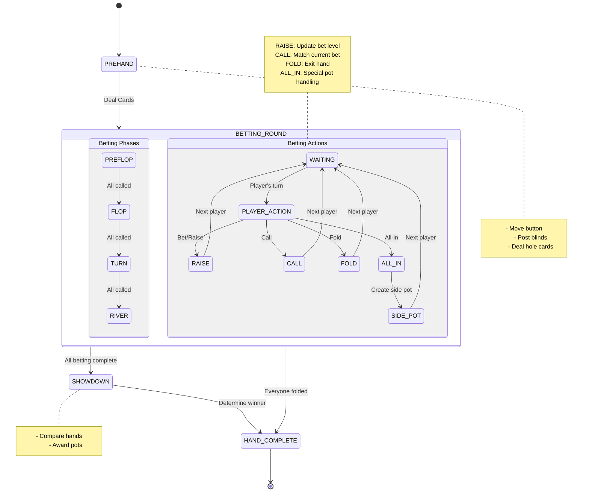
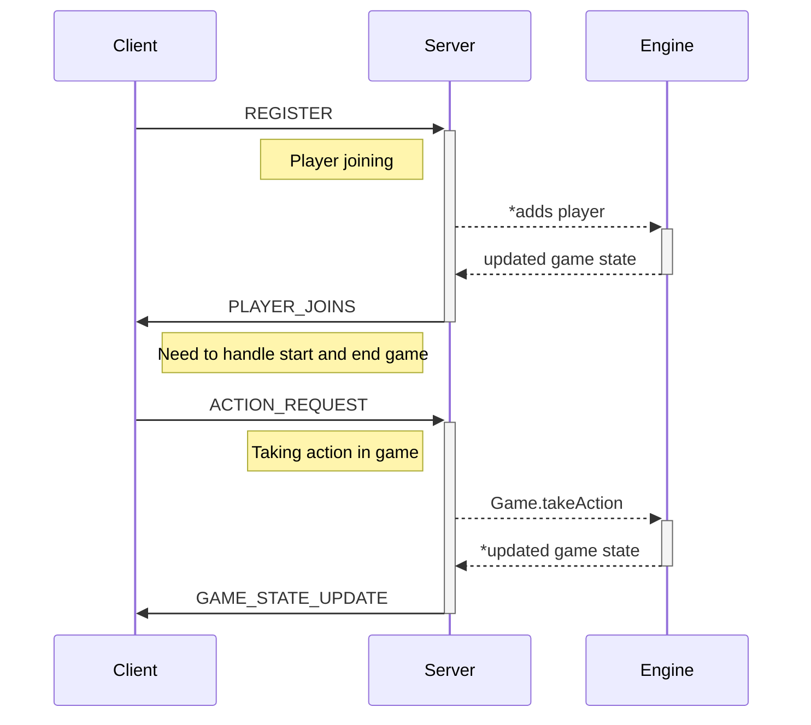

## Game Engine

```mermaid
stateDiagram-v2
    [*] --> PREHAND
    PREHAND --> BETTING_ROUND: Deal Cards
    
    state BETTING_ROUND {
        direction LR
        
        state "Betting Phases" as betting_phases {
            PREFLOP --> FLOP: All called
            FLOP --> TURN: All called
            TURN --> RIVER: All called
        }
        
        state "Betting Actions" as betting_actions {
            WAITING --> PLAYER_ACTION: Player's turn
            PLAYER_ACTION --> RAISE: Bet/Raise
            PLAYER_ACTION --> CALL: Call
            PLAYER_ACTION --> FOLD: Fold
            PLAYER_ACTION --> ALL_IN: All-in
            
            RAISE --> WAITING: Next player
            CALL --> WAITING: Next player
            FOLD --> WAITING: Next player
            ALL_IN --> SIDE_POT: Create side pot
            SIDE_POT --> WAITING: Next player
        }
    }
    
    BETTING_ROUND --> SHOWDOWN: All betting complete
    BETTING_ROUND --> HAND_COMPLETE: Everyone folded
    SHOWDOWN --> HAND_COMPLETE: Determine winner
    HAND_COMPLETE --> [*]

    note right of PREHAND
        - Move button
        - Post blinds
        - Deal hole cards
    end note

    note right of SHOWDOWN
        - Compare hands
        - Award pots
    end note

    note left of betting_actions
        RAISE: Update bet level
        CALL: Match current bet
        FOLD: Exit hand
        ALL_IN: Special pot handling
    end note
```

## Server/Client

```mermaid
sequenceDiagram

    Client->>+Server: REGISTER
    Note left of Server: Player joining
    Server-->>+Engine: *adds player
    Engine-->>-Server: updated game state
    Server->>-Client: PLAYER_JOINS
    Note left of Server: Need to handle start and end game

    

    Client->>+Server: ACTION_REQUEST
    Note left of Server: Taking action in game
    Server-->>+Engine: Game.takeAction
    Engine-->>-Server: *updated game state
    Server->>-Client: GAME_STATE_UPDATE

```