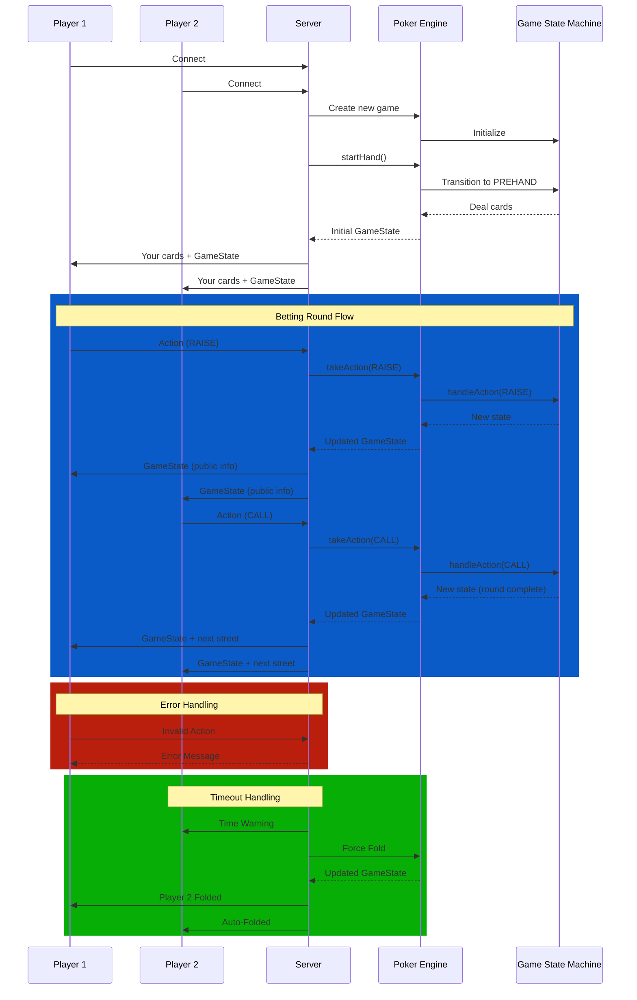

# Control Flow

```mermaid
sequenceDiagram
    participant Client1 as Player 1
    participant Client2 as Player 2
    participant Server
    participant Engine as Poker Engine
    participant StateMachine as Game State Machine
    
    %% Game initialization
    Client1->>Server: Connect
    Client2->>Server: Connect
    Server->>Engine: Create new game
    Engine->>StateMachine: Initialize
    
    %% Game start
    Server->>Engine: startHand()
    Engine->>StateMachine: Transition to PREHAND
    StateMachine-->>Engine: Deal cards
    Engine-->>Server: Initial GameState
    Server->>Client1: Your cards + GameState
    Server->>Client2: Your cards + GameState
    
    %% Betting round example
    rect rgb(10, 90, 200)
        Note over Client1,StateMachine: Betting Round Flow
        Client1->>Server: Action (RAISE)
        Server->>Engine: takeAction(RAISE)
        Engine->>StateMachine: handleAction(RAISE)
        StateMachine-->>Engine: New state
        Engine-->>Server: Updated GameState
        Server->>Client1: GameState (public info)
        Server->>Client2: GameState (public info)
        
        Client2->>Server: Action (CALL)
        Server->>Engine: takeAction(CALL)
        Engine->>StateMachine: handleAction(CALL)
        StateMachine-->>Engine: New state (round complete)
        Engine-->>Server: Updated GameState
        Server->>Client1: GameState + next street
        Server->>Client2: GameState + next street
    end

    %% Error handling
    rect rgb(186, 30, 13)
        Note over Client1,Server: Error Handling
        Client1->>Server: Invalid Action
        Server-->>Client1: Error Message
    end

    %% Timeout handling
    rect rgb(6, 174, 6)
        Note over Client2,Server: Timeout Handling
        Server->>Client2: Time Warning
        Server->>Engine: Force Fold
        Engine-->>Server: Updated GameState
        Server->>Client1: Player 2 Folded
        Server->>Client2: Auto-Folded
    end
```