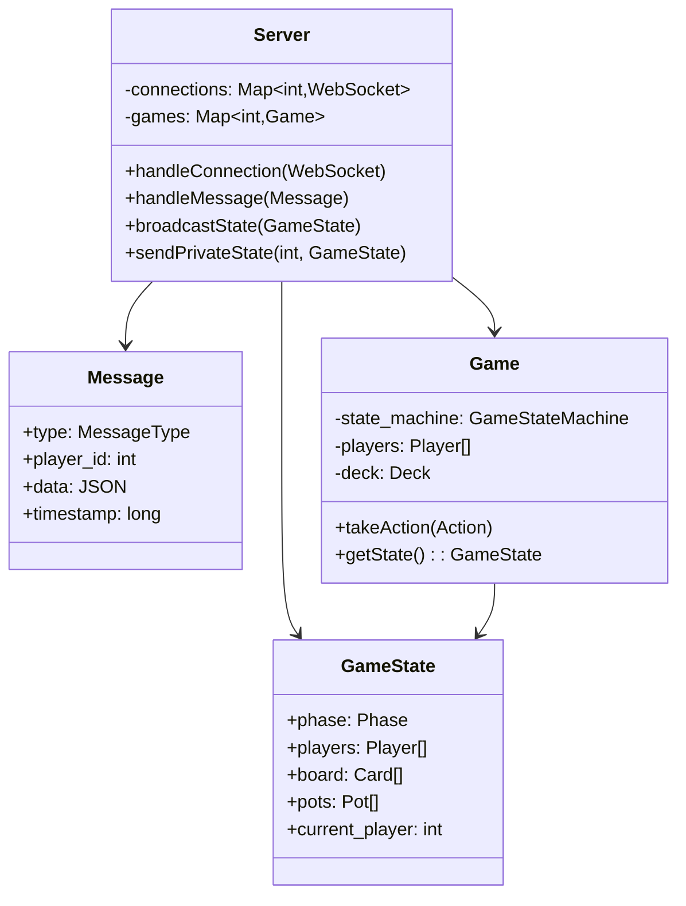

## message flow

```mermaid
classDiagram
    class Message {
        +type: MessageType
        +player_id: int
        +data: JSON
        +timestamp: long
    }

    class GameState {
        +phase: Phase
        +players: Player[]
        +board: Card[]
        +pots: Pot[]
        +current_player: int
    }

    class Server {
        -connections: Map~int,WebSocket~
        -games: Map~int,Game~
        +handleConnection(WebSocket)
        +handleMessage(Message)
        +broadcastState(GameState)
        +sendPrivateState(int, GameState)
    }

    class Game {
        -state_machine: GameStateMachine
        -players: Player[]
        -deck: Deck
        +takeAction(Action)
        +getState(): GameState
    }

    Server --> Message
    Server --> GameState
    Server --> Game
    Game --> GameState
```