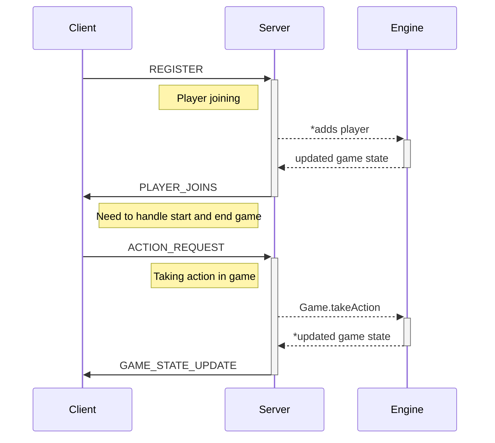

## Server/Client

```mermaid
sequenceDiagram

    Client->>+Server: REGISTER
    Note left of Server: Player joining
    Server-->>+Engine: *adds player
    Engine-->>-Server: updated game state
    Server->>-Client: PLAYER_JOINS
    Note left of Server: Need to handle start and end game

    

    Client->>+Server: ACTION_REQUEST
    Note left of Server: Taking action in game
    Server-->>+Engine: Game.takeAction
    Engine-->>-Server: *updated game state
    Server->>-Client: GAME_STATE_UPDATE

```