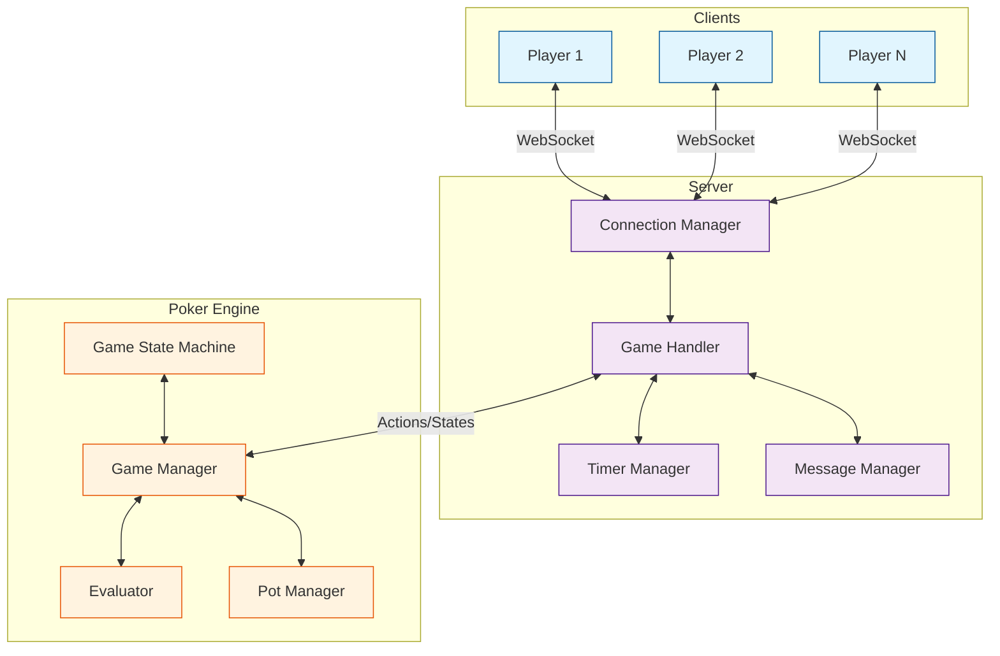

## system arch

```mermaid
flowchart TB
    subgraph Clients
        C1[Player 1]
        C2[Player 2]
        C3[Player N]
    end

    subgraph Server
        direction TB
        CM[Connection Manager]
        GH[Game Handler]
        TM[Timer Manager]
        MM[Message Manager]
        
        CM <--> GH
        GH <--> TM
        GH <--> MM
    end

    subgraph "Poker Engine"
        direction TB
        GSM[Game State Machine]
        GM[Game Manager]
        EV[Evaluator]
        PM[Pot Manager]
        
        GSM <--> GM
        GM <--> EV
        GM <--> PM
    end

    C1 <-->|WebSocket| CM
    C2 <-->|WebSocket| CM
    C3 <-->|WebSocket| CM
    
    GH <-->|Actions/States| GM

    %% Data flow annotations
    classDef client fill:#e1f5fe,stroke:#01579b
    classDef server fill:#f3e5f5,stroke:#4a148c
    classDef engine fill:#fff3e0,stroke:#e65100
    
    class C1,C2,C3 client
    class CM,GH,TM,MM server
    class GSM,GM,EV,PM engine
```